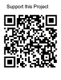
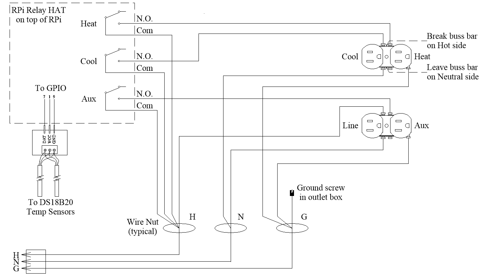
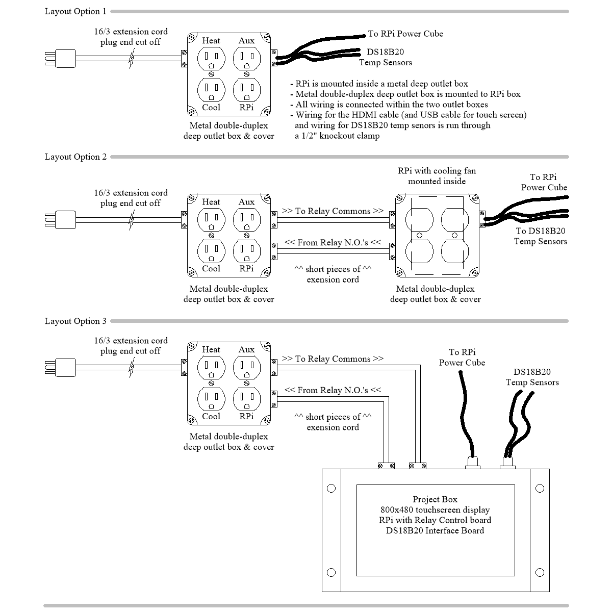

## 💻 FermVault App

The **FermVault App** monitors the temperature of a fermenting product (beer, wine, mead, etc.) inside a refrigerator or freezer. The app turns the appliance on or off, and optionally a heater on or off, to maintain a consistent fermentation temperature. The temperature of the fermenting product or the ambient airspace in the chamber can be used as the control point. PID regulation ensures accurate temperature control with very little or no overshoot or undershoot of the setpoint temperature. Robust email notifications allow flexible remote monitoring.

Currently tested only on the Raspberry Pi3B and Pi4 running Trixie and Bookworm. Should work with RPi5 running the same OS's but not yet tested.

Please **donate $$** if you use the app. 



## 💻 Suite of Apps for the Home Brewer
**🔗 [KettleBrain Project](https://github.com/keglevelmonitor/kettlebrain)** An electric brewing kettle control system

**🔗 [FermVault Project](https://github.com/keglevelmonitor/fermvault)** A fermentation chamber control system

**🔗 [KegLevel Lite Project](https://github.com/keglevelmonitor/keglevel_lite)** A keg level monitoring system

**🔗 [BatchFlow Project](https://github.com/keglevelmonitor/batchflow)** A homebrew batch management system

**🔗 [TempMonitor Project](https://github.com/keglevelmonitor/tempmonitor)** A temperature monitoring and charting system


## To Install the App

Open **Terminal** and run this command. Type carefully and use proper uppercase / lowercase because it matters:

```bash
bash <(curl -sL bit.ly/fermvault)
```

That's it! You will now find the app in your application menu under **Other**. You can use the "Check for Updates" function inside the app to install future updates.

## 🔗 Detailed installation instructions

👉 (placeholder for detailed installation instructions)

## ⚙️ Summary hardware requirements

Required
* Raspberry Pi 3B (should work on RPi 4 but not yet tested)
* Debian Trixie OS (not tested on any other OS)

## ⚙️ Hardware Requirements

For the complete list of required hardware, part numbers, and purchasing links, please see the detailed hardware list:

➡️ **[View Detailed Hardware List](src/assets/hardware.md)**

## ⚡ Quick Wiring Diagram



## ⚡ Build Ideas
The project can be built many different ways. Here are three ideas:
* Layout 1 has the RPi mounted inside a metal double-duplex outlet box, and mounted on top of that is a metal double-duplex outlet box with the duplex outlets installed inside it. All of the wiring is contained within the two metal boxes. This is the simplest and lowest-cost method. This method is best if you are using the RPi "headless" (no monitor our keyboard/mouse) with VNC or RPi Connect to access the RPi. If a dedicated screen is desired, the cables for an HDMI touch screen can be run through another knockout strain relief.
* Layout 2 is just like Layout 1 except the box with the RPi is separate, and the wiring is run between the two metal boxes. 
* Layout 3 is a "turnkey" setup with an 800x480 touchscreen display mounted to a project box, with the AC wiring running between the metal double-duplex outlet box and the project box. This is the layout described in the build tutorial.
* These are just three ideas for the build. It is your project, so you can build it out any way you wish. 



## To uninstall the App

To uninstall, open **Terminal** and run this command. Type carefully and use proper uppercase / lowercase because it matters:

```bash
bash <(curl -sL bit.ly/fermvault)
```

## ⚙️ For reference

Installed file structure:

```
~/fermvault/
|-- utility files...
|-- src/
|   |-- application files...
|   |-- assets/
|       |-- supporting files...
|-- venv/
|   |-- python3 & dependencies
~/fermvault-data/
|-- user data...
    
Required system-level dependencies are installed via sudo apt outside of venv.

```


